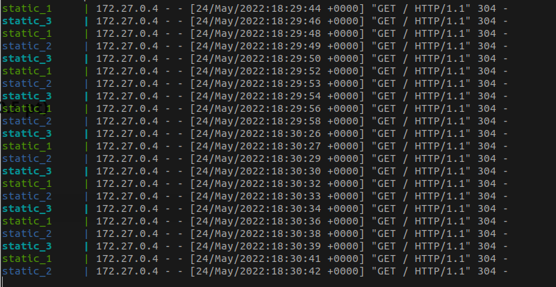
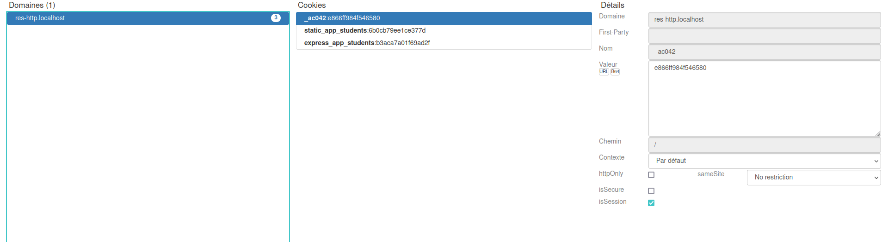
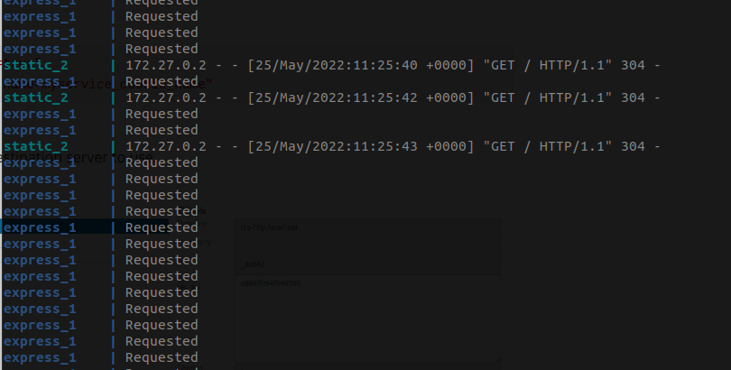
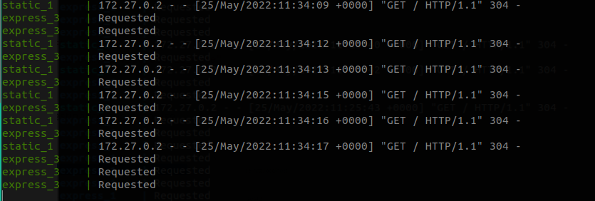
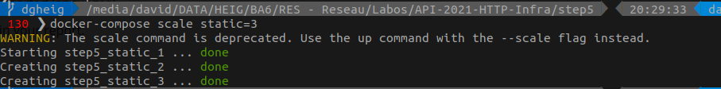
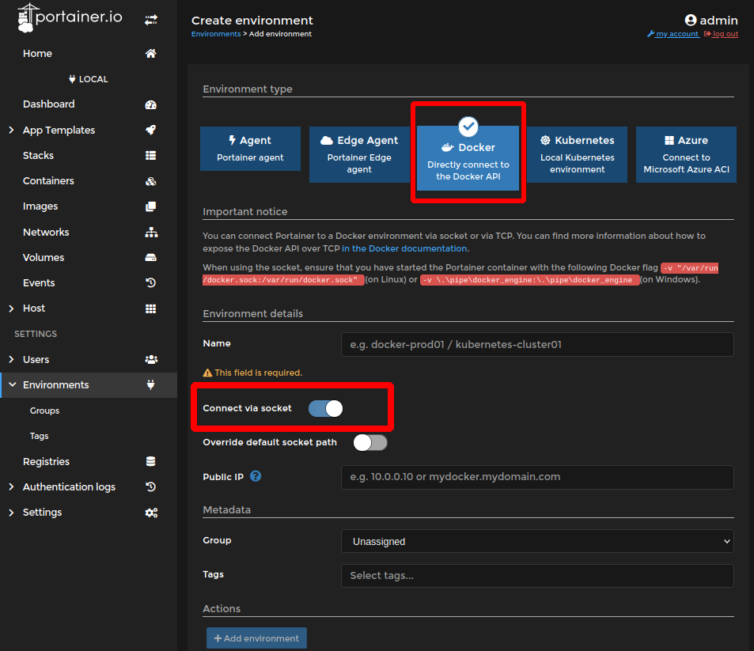

# Labo HTTP Infra

[TOC]

## Directives summary

### Objectives

* Learn (web infra, apache2 and express.js)
* Implement (dynamic web app HTML, CSS, JS + Ajax Requests)
* Practice (docker)


### General instructions

* Instructions are given through videos at each step (if correctly done, ensure a grade of 4.5)

* The rest of the points come from your own research and creativity.

* We can use other technologies if we want (apache $\Leftrightarrow$ nginx, express.js $\Leftrightarrow$ django, ...)

  > Go ahead, we **LOVE** that


Nb: Provide a way to see the result of each step individually (?)

## Required Steps (max grade: 4.5)

### Step 1: Static HTTP server with apache httpd

#### Goals

* Create a github repository
* Create a apache2 docker image with custom content


[startbootstrap.com](https://startbootstrap.com/): some bootstrap templates.

The template we used: [Freelancer](https://startbootstrap.com/theme/freelancer) [(download)](https://github.com/startbootstrap/startbootstrap-freelancer/archive/gh-pages.zip)

```bash
# Build
## Using Docker
docker build -f apache2.Dockerfile -t res-http-apache2-static .
## Using Docker compose
docker-compose build

# Run
## Using Docker
docker run -p "8080:80" res-http-apache2-static
## Using Docker compose (Build + Run)
docker-compose up # add -d option to run as a daemon (i.e in the background)
```


### Step 2: Dynamic HTTP server with express.js

#### Goals

* Write a dynamic HTTP app (express.js)
* Query the server (postman)


We made 3 versions:

* ExpressJs

* [Flask](https://flask.palletsprojects.com/en/2.1.x/)

* [CrowCpp](https://github.com/CrowCpp/Crow): The build has been leveraged using 2 methods:

  * Using a docker container as a build environement:

    ```bash
    # Build the build environment image
    docker build -f build.Dockerfile -t res-crow-build .
    # Mount the sources and build. The binary will then be available in the sources' folder
    docker run --rm -v "$PWD:/build" res-crow-build g++ server.cpp -o server -lpthread
    # Create the final image by copying the binary inside of it
    docker build --no-cache -f crow.Dockerfile -t res-crow .
    ```

    (see `step2/cpp/build.sh` script)

    This method is better when building with local cache (e.g. node) since we won't have to pull then everytime.

  * Using Docker [multi-step build](https://docs.docker.com/develop/develop-images/multistage-build/):

    1. One image is created with the required package to build
    2. A second image is created from the previous one and the sources. The binary is built inside of this image
    3. This final image will simply copy from the second one the compiled binary.

    This method is standalone and perfectly reproducible, but will take longer since it won't be able to remember cache information between the builds


### Step 3: Reverse proxy with apache (static configuration)

#### Goals

see [Reverse Proxy Guide](https://httpd.apache.org/docs/2.4/en/howto/reverse_proxy.html)


#### Remarks

* This step re-use the images generated on step 1 and 2. They must have been built beforehand.
* We used `*.localhost` domains to avoid dealing with DNS and updating configuration files.
* This is NOT possible to prevent access to containers from host by just using Docker. The containers are using interfaces on the host machine. **BUT** the browsers have a same-origin-policy which prevent cross-origin-resource-sharing, i.e. fetch data from another source than the current page's one.
  But, on Windows and Mac using Docker-Desktop, docker is run in a virtual machine. In this case, the services are not available from the host directly without using a port forward.
* Docker networks have their own dns resolution, we do not need to use static ip adresses and can use hostnames instead. This allow us to have 2 or more proxypass for the same host using `aliases`  to have multiple domains for each host.
* The apache static configuration will have to be updated manually each time a network change is made (change of ip/hostname, adding/removing service/replicas, ...)


### Step 4: AJAX requests with JQuery

#### Goals

* Use Jquery to make an AJAX request

* Jquery is not part of bootstrap anymore. We had to import it from a CDN.

  ```html
  <script src="https://code.jquery.com/jquery-3.6.0.min.js" integrity="sha256-/xUj+3OJU5yExlq6GSYGSHk7tPXikynS7ogEvDej/m4=" crossorigin="anonymous"></script>
  ```


#### Remarks

* This step re-use the images generated on step 1 and 2. They must have been built beforehand.


### Step 5: Dynamic reverse proxy configuration

#### Goals

* Use traefik for dynamic reverse proxy.


## Additional steps to get extra points on top of the "base" grade

### Load balancing: multiple server nodes (0.5 pt)

Using Traefik, we juste need to have many instance of the same service routed by traefik (i.e. the correct labels must be defined)

```yaml
- "traefik.enable=true"
- "traefik.http.routers.static.rule=Host(`res-http.localhost`)"
- "traefik.http.routers.static.entrypoints=web"
```


We can see that the default behavior is using a round-robin load balancing.




### Load balancing: round-robin vs sticky sessions (0.5 pt)

To use sticky sessions, we need 2 labels:

```yaml
- "traefik.http.services.myservername.loadbalancer.sticky.cookie=true"
- "traefik.http.services.myservername.loadBalancer.sticky.cookie.name=myservice_cookie_name"
```

* the `cookie=true` enable the sticky session cookie
* the `cookie.name=...` used to know the cookie used to remember the destination server to use.
  By default, a name is provided using a hash



(This view of the cookie is provided by ["Cookie Quick Manager" Firefox extension](https://addons.mozilla.org/fr/firefox/addon/cookie-quick-manager/))


As we can see, each reload of the page will request the `static_2` server, eventhough there are 2 other server `statcic_1` and `static_3`. Also, this server will always query the same express server `express_1`




But when accessed from another context (using another browser or private navigation), we may use other servers



### Dynamic cluster management (0.5 pt)

```bash
docker-compose scale static=3
```



This command will take the service `static` (according to the docker-compose file) and create/delete instances to match the requested number of instance (here: 3).

We can scale many services at once

```bash
docker-compose scale static=3 express=4
```


### Management UI (0.5 pt)

We will use [Portainer-ce](https://docs.portainer.io/v/ce-2.9/).

```yaml
  portainer:
    image: portainer/portainer-ce:latest
    container_name: portainer
    restart: unless-stopped
    security_opt:
      - no-new-privileges:true
    volumes:
      - /etc/localtime:/etc/localtime:ro
      - /var/run/docker.sock:/var/run/docker.sock:ro
      - portainer-data:/data
    ports:
      - 9000:9000
```

Nb: We do not need special routing from traefik.

* The UI is available at `localhost:9000`.

* We need to configure a local docker by using the socket (available inside the container through a mount)

  